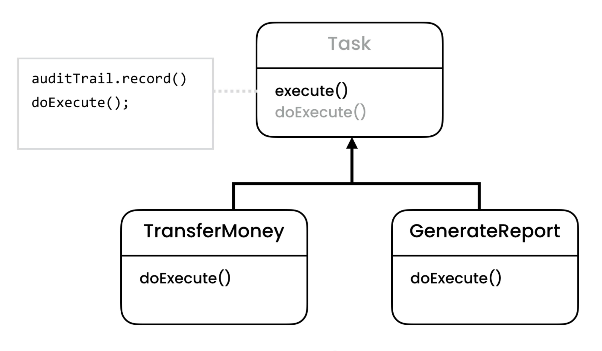

# Desing-Patterns

<table>
<tr>
<td>
Memento Pattern

</td>
<td>
State Pattern

</td>
</tr>
<tr>
<td>
Iterator Pattern

</td>
<td>
Strategy Pattern

</td>
</tr>
<tr>
<td>
Template Method Pattern

</td>
<td>

</td>
</tr>
</table>
